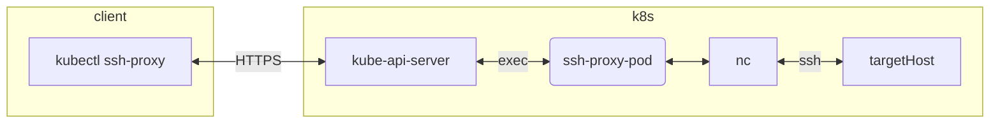

# kubectl ssh-proxy

Proxy OpenSSH client tools through Kubernetes pod



## Prerequisites
- [kubectl](https://kubernetes.io/docs/tasks/tools/#kubectl)
- [krew](https://krew.sigs.k8s.io/docs/user-guide/setup/install/)

## Installation
    kubectl krew install --manifest-url https://raw.githubusercontent.com/infinite-turtles/kubectl-ssh-proxy/main/deploy/krew/plugin.yaml

## Usage
```
kubectl ssh-proxy [flags] ssh|scp|sftp [flags] [arguments]

# ssh login to remote system
kubectl ssh-proxy ssh user@hostname

# scp secure file copy
kubectl ssh-proxy scp localpath [user@]host:[path]

# sftp secure file transfer
kubectl ssh-proxy sftp [user@]host[:path]
```

## Use with K9s Plugin

The [K9s](https://github.com/derailed/k9s) project has a plugin feature that allows users to configure key-mappings to execute commands on your system.

**Demo**:

[](https://asciinema.org/a/515325)


**Configure K9s**:

The following implements a plugin that uses `kubectl-ssh-proxy` to easily SSH into any node directly from K9s.  First, create or modify the file `$XDG_CONFIG_HOME/k9s/plugin.yml`. If `XDG_CONFIG_HOME` is not used in your terminal, simply define it to any directory.

Example:

```bash
export XDG_CONFIG_HOME=$HOME/.config
```
> Older versions of k9s might have config in `~/.k9s/` instead.

Next create the `$XDG_CONFIG_HOME/k9s/plugin.yml` file:

```yaml
# $XDG_CONFIG_HOME/k9s/plugin.yml
plugin:
  # Defines a plugin to provide a `ctrl-n` shortcut to tail the logs while in node view.
  ksshNode:
    # Define a mnemonic to invoke the plugin
    shortCut: Ctrl-N
    # What will be shown on the K9s menu
    description: Node SSH
    # Collections of views that support this shortcut. (You can use `all`)
    scopes:
    - no
    # The command to run upon invocation. Can use Krew plugins here too!
    command: kubectl-ssh-proxy
    # Whether or not to run the command in background mode
    background: false
    # Defines the command arguments
    args:
    - ssh
    - ec2-user@$NAME

  # Defines a plugin to provide a `ctrl-n` shortcut to tail the logs while in pod view.
  ksshPod:
    # Define a mnemonic to invoke the plugin
    shortCut: Ctrl-N
    # What will be shown on the K9s menu
    description: Node SSH
    # Collections of views that support this shortcut. (You can use `all`)
    scopes:
    - po
    # The command to run upon invocation. Can use Krew plugins here too!
    command: kubectl-ssh-proxy
    # Whether or not to run the command in background mode
    background: false
    # Defines the command arguments
    args:
    - ssh
    - ec2-user@$COL-NODE
```

After this you should be ready to to start up K9s. Then simply select a node, press `ctrl-n`, and viola! `kubectl-ssh-proxy` is used to SSH into the selected node.
