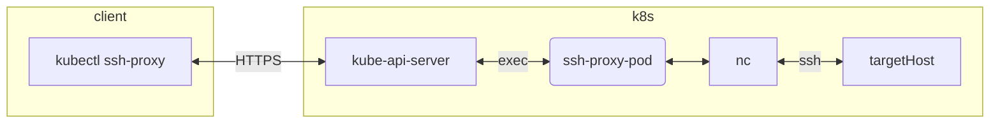

# kubectl ssh-proxy

Proxy OpenSSH client tools through Kubernetes pod



## Prerequisites
- [kubectl](https://kubernetes.io/docs/tasks/tools/#kubectl)
- [krew](https://krew.sigs.k8s.io/docs/user-guide/setup/install/)

## Installation
    kubectl krew install --manifest-url https://raw.githubusercontent.com/infinite-turtles/kubectl-ssh-proxy/main/deploy/krew/plugin.yaml

## Usage
```
kubectl ssh-proxy [flags] ssh|scp|sftp [flags] [arguments]

# ssh login to remote system
kubectl ssh-proxy ssh user@hostname

# scp secure file copy
kubectl ssh-proxy scp localpath [user@]host:[path]

# sftp secure file transfer
kubectl ssh-proxy sftp [user@]host[:path]
```